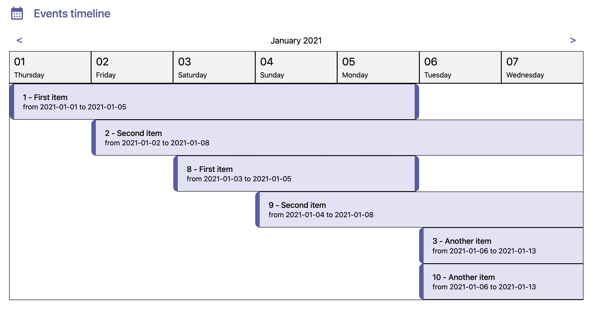

# Events Timeline

### Author: Marcelo Higuti

This web application is using React, Typescript and SASS created by the tool [Vite](https://vitejs.dev/) and it displays a timeline of events in a calendar way.

> The start and end date is being demonstrated only to be easier to check if the UI is OK. It can be easily hidden to satisfy the requirements.



## Installation

This app requires [Node.js](https://nodejs.org/) to run.

Install the dependencies and start the app.

```sh
cd events-timeline
npm install
npm run dev
```

## Customization

In this path:

```sh
/src/services/data/timelineItems.ts
```

You can find the list of events provided as an example, feel free to customize and add new events to show how it's going to be displayed in the application. (Please just keep the structure of the JSON)

## Summary

_Q: How long you spent on the assignment._
A: It took 4 hours to do this task, having to split the development time in different days due to some appointments.

_Q: What you like about your implementation._
A: Those are the highlights of this application:

- The modular way all the components and logics were created.
- Code simpler to understand in the declarative way it was developed.
- Easier to modify as the typescript ensures everything will work as expected if the typings are respected.
- Clean and easy to test the business logics as everything was created as util functions or custom hooks.
- The pagination way to see events by week and having an indication by the UI of the start and end date.
- Having the ability to change the event name by inline clicking.
- Easy layout modification by classes well created in nested way, with SASS, for each modular component or page.

_Q: What you would change if you were going to do it again._
A: The modifications:

- Based on Microsoft Teams, I have already decided to change some aspects like the zoom to pagination as we could improve the User Experience by not having a scroll and instead demonstrating to the user the duration of the events by pages and the UI, also will render less components to be faster and create a focus for the user.
- I would have add a way to change the start and end day of the event with calendar inputs, but also having to store the events data in a persistent way not just temporary.
- I would have created more placeholders and mixins to avoid duplication in CSS or used another library (like style components) to help create the different styles needed.
- Improvements in the layout checking with a design team.

_Q: How you made your design decisions. For example, if you looked at other timelines for inspiration, please note that._
A: When I saw the requirement of events with different duration times, it came to my mind the tool Microsoft Teams and I used as inspiration to create the calendar layout with visual indication of the events that are starting or ending in a specific day.

_Q: How you would test this if you had more time._
A: Using libraries like jest and react testing library it would be easy to test if the modular components are working as expected with unit tests.
As the code is well architectured in functions and custom hooks, we can also test those logics without the need to render all the application and having the possibility to test different cases and data with dependency injection.
